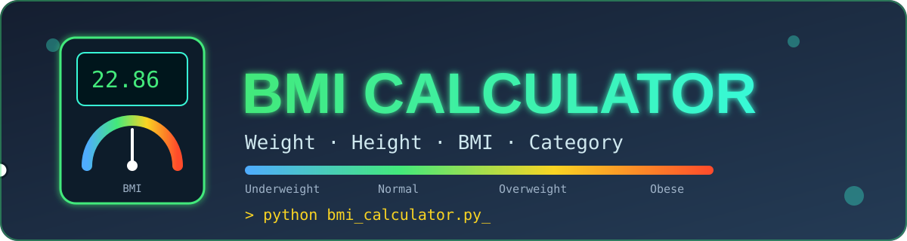

<div align="center">



<br/>


<h3>⚖️ A simple Python project that calculates BMI and tells your category ⚖️</h3>

<p>
  <a href="#-features">Features</a> •
  <a href="#-bmi-formula">Formula</a> •
  <a href="#-bmi-categories">Categories</a> •
  <a href="#-how-to-run">How to Run</a> •
  <a href="#-sample-output">Sample Output</a> •
  <a href="#-author">Author</a>
</p>

</div>

---

## 📖 Description

**BMI Calculator** is a simple Python project that calculates a person's **Body Mass Index (BMI)** using their weight and height. It also determines the **BMI category** based on standard BMI ranges.

---

## ✨ Features

| | Feature |
|---|---|
| 🧑 | Enter Name |
| 🎂 | Enter Age |
| 🚻 | Enter Gender |
| ⚖️ | Enter Weight (kg) |
| 📏 | Enter Height (m) |
| ✅ | Validate Weight and Height |
| 🧮 | Calculate BMI |
| 🏷️ | Display BMI Category |
| 🎨 | User-Friendly Output |

---

## 🧮 BMI Formula

<div align="center">

### `BMI = Weight (kg) / Height² (m)`

</div>

---

## 📊 BMI Categories

| BMI Range | Category |
|:---:|:---:|
| Less than 18.5 | 🔵 Underweight |
| 18.5 – 24.9 | 🟢 Normal Weight |
| 25.0 – 29.9 | 🟡 Overweight |
| 30.0 and Above | 🔴 Obese |

---

## 🛠️ Technologies Used

<p>
  
</p>

---

## 📂 Project Structure

```
BMI-Calculator/
│── assets/
│   └── banner.svg
│── bmi_calculator.py
└── README.md
```

---

## 🚀 How to Run

1. 📁 Open the project folder.
2. 💻 Open Terminal or Command Prompt.
3. ▶️ Run the following command:

```bash
python bmi_calculator.py
```

---

## 🖥️ Sample Output

```
Enter Name = Sudhanshu
Enter Age = 21
Enter Gender = Male
Enter Weight = 70
Enter Height = 1.75

--------------------------------------
Name : Sudhanshu
Age : 21
Gender : Male
Weight : 70 kg
Height : 1.75 m
BMI : 22.86
Category : Normal Weight
```

---

## 👨‍💻 Author

<div align="center">

**Sudhanshu Dhande**

⭐ *If you like this project, don't forget to give it a star!* ⭐

</div>