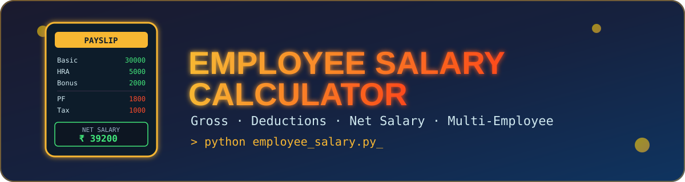

<div align="center">



<br/>


<h3>💼 A simple Python project that calculates Gross Salary, Total Deduction & Net Salary 💼</h3>

<p>
  <a href="#-features">Features</a> •
  <a href="#-salary-calculation">Calculation</a> •
  <a href="#️-how-to-run">How to Run</a> •
  <a href="#-example-output">Example Output</a> •
  <a href="#-future-improvements">Future Improvements</a> •
  <a href="#-author">Author</a>
</p>

</div>

---

## 📖 Description

A simple **Python-based Employee Salary Calculator** project that calculates an employee's **Gross Salary, Total Deduction, and Net Salary**.

This project is created using basic Python concepts such as **Variables, Input/Output, If-Else, While Loop, Functions, Lists, and Dictionaries**.

---

## 📌 Features

| | Feature |
|---|---|
| 👤 | Enter Employee ID |
| 🧑 | Enter Employee Name |
| 🏢 | Enter Department |
| 💰 | Enter Basic Salary |
| 🏠 | Enter HRA |
| 💵 | Enter DA |
| 🚗 | Enter TA |
| 🎁 | Enter Bonus |
| 🏦 | Enter PF |
| 🧾 | Enter Tax |
| 📊 | Calculate Gross Salary |
| ➖ | Calculate Total Deduction |
| 💸 | Calculate Net Salary |
| 📋 | Store employee details in a list |
| 🔄 | Add details for multiple employees |

---

## 🧮 Salary Calculation

<div align="center">

**Gross Salary**
```text
Gross Salary = Basic Salary + HRA + DA + TA + Bonus
```

**Total Deduction**
```text
Total Deduction = PF + Tax
```

**Net Salary**
```text
Net Salary = Gross Salary - Total Deduction
```

</div>

---

## 🛠️ Technologies Used

<p>
  
  
  
  
  
</p>

- Python 3
- Lists
- Dictionaries
- Functions
- While Loop
- If-Else
- User Input
- Arithmetic Operators

---

## 📂 Project Structure

```
Employee-Salary-Calculator/
│── assets/
│   └── banner.svg
│── employee_salary.py
└── README.md
```

---

## ▶️ How to Run

**1. Clone the Repository**
```bash
git clone <your-repository-url>
```

**2. Open the Project Folder**
```bash
cd Employee-Salary-Calculator
```

**3. Run the Python File**
```bash
python employee_salary.py
```

---

## 💻 Example Input

```text
Check the Employee Salary Details (yes/no) = yes

========== EMPLOYEE SALARY DETAILS ==========

Employee ID    : 101
Employee Name  : Rahul
Department     : IT
Basic Salary   : 30000
HRA            : 5000
DA             : 3000
TA             : 2000
Bonus          : 2000
PF             : 1800
Tax            : 1000
```

---

## 📤 Example Output

```text
========== EMPLOYEE SALARY DETAILS ==========

Employee ID     = 101
Employee Name   = Rahul
Department      = IT

Basic Salary    = 30000
HRA             = 5000
DA              = 3000
TA              = 2000
Bonus           = 2000

Gross Salary    = 42000

PF              = 1800
Tax             = 1000
Total Deduction = 2800

-----------------------------------------
Net Salary      = 39200
=========================================
```

---

## 📚 Python Concepts Practiced

This project helped me practice:

1. Variables
2. Data Types
3. `input()`
4. Type Casting
5. Arithmetic Operators
6. `if-elif-else`
7. `while` Loop
8. Functions
9. Lists
10. Dictionaries
11. `append()`
12. String Methods
13. Basic Salary Calculations

---

## 🚀 Future Improvements

The project can be improved by adding:

- 🔹 Search employee by ID
- 🔹 Display all employees
- 🔹 Find highest salary
- 🔹 Find lowest salary
- 🔹 Calculate average salary
- 🔹 Update employee details
- 🔹 Delete employee details
- 🔹 Save employee data in a file
- 🔹 Add a database
- 🔹 Create a GUI using Tkinter or PyQt

---

## 👨‍💻 Author

<div align="center">

**Sudhanshu Dhande**
B.Tech Artificial Intelligence Student

### ⭐ Project Status
**Completed — Python Basics Project**
_More features will be added as I continue learning Python._

⭐ *If you like this project, don't forget to give it a star!* ⭐

</div>