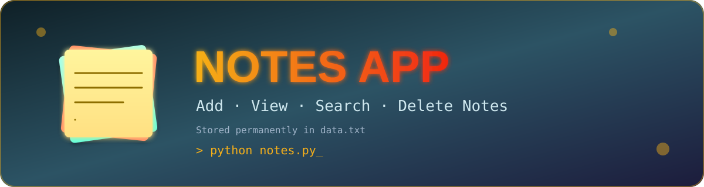

<div align="center">



<br/>


<h3>📝 A simple Notes App built using Python with permanent file storage 📝</h3>

<p>
  <a href="#-features">Features</a> •
  <a href="#️-how-to-run">How to Run</a> •
  <a href="#-menu-options">Menu</a> •
  <a href="#-concepts-learned">Concepts</a> •
  <a href="#-author">Author</a>
</p>

</div>

---

## 📖 About

A simple **Notes App built using Python** that allows users to add, view, search, and delete notes. Notes are stored permanently in a text file (`data.txt`).

---

## 🚀 Features

| | Feature |
|---|---|
| ➕ | Add a new note |
| 👀 | View all saved notes |
| 🔍 | Search notes using keywords |
| 🗑️ | Delete a selected note |
| 🚪 | Exit the application |
| 💾 | Notes are stored in `data.txt` |

---

## 🛠️ Technologies Used

<p>
  
  
  
  
  
</p>

- **Python**
- **File Handling**
- **Functions**
- **Lists**
- **Loops**
- **Conditional Statements**
- **String Operations**

---

## 📂 Project Structure

```text
Notes-App/
│
├── assets/
│   └── banner.svg
├── notes.py
├── data.txt
└── README.md
```

| File | Description |
|---|---|
| 📄 `notes.py` | Contains the complete Python program for the Notes App |
| 📄 `data.txt` | Stores all notes entered by the user |
| 📄 `README.md` | Contains information and documentation about the project |

---

## ▶️ How to Run

**1. Clone the repository**
```bash
git clone https://github.com/sudhanshudhande19/Simple-Project-python.git
```

**2. Open the Notes-App folder**
```bash
cd Simple-Project-python/Notes-App
```

**3. Run the Python program**
```bash
python notes.py
```

---

## 📋 Menu Options

When the application starts, it displays:

```text
===========================
         NOTES APP
===========================

1. Add Note
2. View Note
3. Search Note
4. Delete Note
5. Exit
```

### 1️⃣ Add Note
Enter a note and it will be saved in `data.txt`.

```text
Enter Your Note: Learn Python File Handling
Note Added Successfully!
```

### 2️⃣ View Note
Displays all saved notes with their note numbers.

```text
========== YOUR NOTES ==========
1. Learn Python
2. Practice File Handling
3. Build Python Projects
================================
```

### 3️⃣ Search Note
Searches saved notes using a keyword.

```text
Enter The Keyword: Python

Learn Python
Python Projects

Searching The Note Successfully!
```

### 4️⃣ Delete Note
Displays all notes and allows the user to delete a note by entering its number.

```text
Enter Note Number To Delete: 2

Deleted Note: Practice File Handling
Note Deleted Successfully!
```

### 5️⃣ Exit
Closes the Notes App.

```text
=================================
Thank you for using Notes App!
=================================
```

---

## 📚 Concepts Learned

This project demonstrates practical use of:

- Python functions
- `input()` and `print()`
- `if-elif-else`
- `while` loops
- Lists
- `enumerate()`
- String methods
- File handling
- `open()`
- `readlines()`
- `write()`
- `writelines()`
- Append mode (`a`)
- Read mode (`r`)
- Write mode (`w`)

---

## 🎯 Purpose of the Project

This project was created to practice **Python fundamentals and file handling** by building a simple real-world application.

---

## ⭐ Future Improvements

The project can be improved in the future by adding:

- 🔹 Edit/Update Note feature
- 🔹 Note timestamps
- 🔹 Categories for notes
- 🔹 Better error handling
- 🔹 GUI using Tkinter or PyQt
- 🔹 Database storage using SQLite
- 🔹 User authentication

---

## 👨‍💻 Author

<div align="center">

**Sudhanshu Dhande**
Python | AI/ML Student

⭐ *If you like this project, don't forget to give it a star!* ⭐

</div>