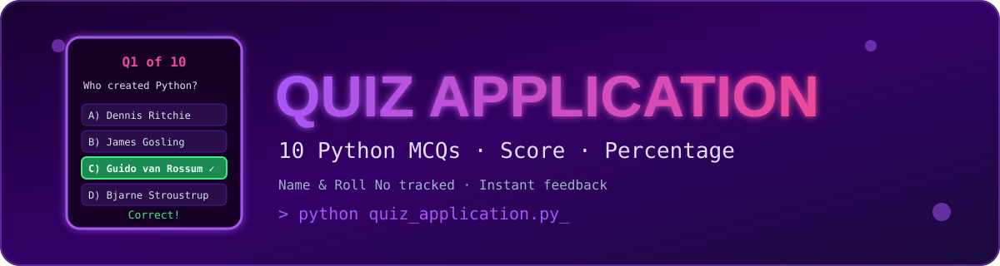

<div align="center">



<br/>


<h3>🧠 A simple command-line quiz application to test your Python knowledge 🧠</h3>

<p>
  <a href="#-features">Features</a> •
  <a href="#-how-it-works">How It Works</a> •
  <a href="#️-how-to-run">How to Run</a> •
  <a href="#-sample-output">Sample Output</a> •
  <a href="#-author">Author</a>
</p>

</div>

---

## 📖 About

A simple command-line quiz application built in Python that tests users on their knowledge of the **Python programming language**. The application asks **10 multiple-choice questions**, tracks the user's score, and displays a final result summary.

---

## ✨ Features

| | Feature |
|---|---|
| 🖥️ | Interactive CLI-based quiz with a welcome screen |
| 🧑 | Collects user's **Name** and **Roll No** before starting |
| ❓ | 10 multiple-choice questions (options A, B, C, D) covering Python basics |
| ⚡ | Instant feedback ("Correct" / "Wrong") after each answer |
| 📊 | Final result summary including total, correct, wrong, score & percentage |
| ⏭️ | Option to skip the quiz by entering "No" at the start |

**Final Result Summary includes:**
- Total questions
- Number of correct answers
- Number of wrong answers
- Score (out of 10)
- Percentage scored

---

## ⚙️ How It Works

1. The program prints a welcome banner.
2. It stores all 10 quiz questions inside a dictionary via the `application()` function.
3. The user is asked whether they want to start the quiz (`Yes`/`No`).
4. If **Yes**:
   - The user enters their Name and Roll No.
   - Each question is displayed one by one along with 4 options.
   - The user inputs their chosen option (A/B/C/D).
   - Correct answers are appended to a list (`my_list`) used for scoring.
5. If **No**, the program simply prints "Thank You" and exits.
6. At the end of the quiz, a detailed result is displayed, including the score and percentage.

---

## 🛠️ Requirements

<p>
  
</p>

- Python 3.x
- No external libraries required (uses only Python's built-in `input()` and `print()`)

---

## 📂 Project Structure

```text
Quiz-Application/
│── assets/
│   └── banner.svg
│── quiz_application.py
└── README.md
```

---

## ▶️ How to Run

1. Save the script as `quiz_app.py`.
2. Open a terminal in the project directory.
3. Run the following command:

   ```bash
   python quiz_application.py
   ```

4. Follow the on-screen prompts to take the quiz.

---

## 🖥️ Sample Output

```
=======================
        Welcome        
    Quiz Application   
=======================
Start the Quiz Application (Yes/No) = Yes
Enter the Name = Sudhanshu
Enter the Roll No = 101

===== Start Application =====

Q1. Who developed Python programming language?

A) Dennis Ritchie
B) James Gosling
C) Guido van Rossum
D) Bjarne Stroustrup
Enter Option = c
Correct
-----------------------------
...
============ Result ============
Name = Sudhanshu
Roll No = 101
Total Questions = 10
Correct = 8
Wrong = 2
Score = 8 / 10
Percentage = 80.0 %
===============================
========= Thank You ===========
```

---

## 🔮 Possible Future Improvements

- 🔹 Add answer validation (currently invalid inputs are simply marked "Wrong")
- 🔹 Randomize question order for each attempt
- 🔹 Store results in a file (CSV/JSON) for record-keeping
- 🔹 Add a timer for each question
- 🔹 Convert into a GUI or web-based application

---

## 👤 Author

<div align="center">

**Sudhanshu**
B.Tech CSE (AI & ML), Dr. Babasaheb Ambedkar Technological University (BATU), Lonere

⭐ *If you like this project, don't forget to give it a star!* ⭐

</div>