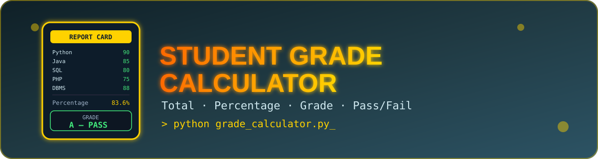

<div align="center">



<br/>


<h3>🎓 A simple Python project that calculates total marks, percentage, grade & result 🎓</h3>

<p>
  <a href="#-features">Features</a> •
  <a href="#️-how-to-run">How to Run</a> •
  <a href="#-sample-output">Sample Output</a> •
  <a href="#-author">Author</a>
</p>

</div>

---

## 📖 Description

A simple Python project that calculates a student's **total marks, percentage, grade, and pass/fail result** based on the marks entered by the user.

---

## ✨ Features

| | Feature |
|---|---|
| 🧑 | Enter Student Name |
| 🆔 | Enter Roll Number |
| 📝 | Input Marks for 5 Subjects |
| ✅ | Validate Marks (0–100) |
| 🏁 | Check Pass/Fail (Minimum 35 Marks in Each Subject) |
| ➕ | Calculate Total Marks |
| 📊 | Calculate Percentage |
| 🏷️ | Display Grade (A, B, C, D) |
| 📋 | Display Final Result |

---

## 🛠️ Technologies Used

<p>
  
</p>

- Python 3

---

## 📂 Project Structure

```
Student-Grade-Calculator/
│── assets/
│   └── banner.svg
│── grade_calculator.py
└── README.md
```

---

## ▶️ How to Run

1. Open Terminal.
2. Navigate to the project folder.
3. Run the following command:

```bash
python grade_calculator.py
```

---

## 🖥️ Sample Output

```
Enter The Student Name = Sudhanshu
Enter the Roll No = 101
Enter The Python Subject Mark = 90
Enter The Java Subject Mark = 85
Enter The SQL Subject Mark = 80
Enter The PHP Subject Mark = 75
Enter The DBMS Subject Mark = 88

Name = Sudhanshu
Roll No = 101
Total Marks = 418
Percentage = 83.6
Grade = A
Result = Pass
```

---

## 👨‍💻 Author

<div align="center">

**Sudhanshu Dhande**

⭐ *If you like this project, don't forget to give it a star!* ⭐

</div>