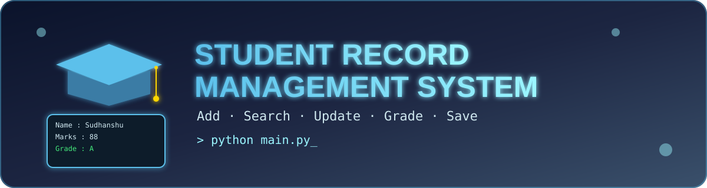

<div align="center">



<br/>


<h3>🎓 A simple Python-based Student Record Management System 🎓</h3>

<p>
  <a href="#-features">Features</a> •
  <a href="#️-technologies-used">Technologies</a> •
  <a href="#️-how-to-run">How to Run</a> •
  <a href="#-sample-menu">Sample Menu</a> •
  <a href="#-author">Author</a>
</p>

</div>

---

## 📖 About

A simple Python-based **Student Record Management System** developed using core Python concepts. This project allows users to manage student records through a **menu-driven interface**.

---

## 🚀 Features

| | Feature |
|---|---|
| ➕ | Add Student Record |
| 👀 | View Student Records |
| 🔍 | Search Student by Name |
| ✏️ | Update Student Details |
| 📊 | Calculate Student Grade |
| 🗑️ | Delete Student Record |
| 💾 | Save Records to Text File |
| 🚪 | Exit Program |

---

## 🛠️ Technologies Used

<p>
  
  
  
  
</p>

- Python 3
- File Handling
- Dictionary
- List
- Functions
- Loops
- Conditional Statements

---

## 📂 Project Structure

```
Student_Record_Management_System/
│── assets/
│   └── banner.svg
│── main.py
│── student_record.txt
│── README.md
```

---

## ▶️ How to Run

1. Clone the repository
2. Open the project folder
3. Run the following command:

```bash
python main.py
```

---

## 📷 Sample Menu

```
========Student Record System========
1. Add Student
2. View Student
3. Search Student
4. Update Student
5. Calculate Grade
6. Delete Student
7. Save to File
8. Exit
=====================================
```

---

## 👨‍💻 Author

<div align="center">

**Sudhanshu Dhande**

B.Tech (Artificial Intelligence)
Karanjekar College of Engineering and Management (KCEM)

⭐ *If you like this project, don't forget to star the repository.* ⭐

</div>