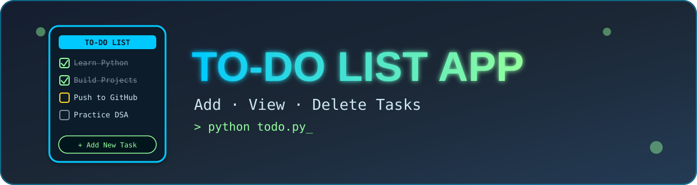

<div align="center">



<br/>


<h3>✅ A simple command-line To-Do List app to manage your daily tasks ✅</h3>

<p>
  <a href="#-features">Features</a> •
  <a href="#️-how-to-run">How to Run</a> •
  <a href="#-menu-options">Menu</a> •
  <a href="#-sample-output">Sample Output</a> •
  <a href="#-author">Author</a>
</p>

</div>

---

## 📖 Description

The **To-Do List App** is a simple command-line Python project that helps users manage their daily tasks. Users can add new tasks, view all tasks, delete completed tasks, and exit the application. This project is useful for learning **Python lists, loops, and conditional statements**.

---

## ✨ Features

| | Feature |
|---|---|
| ➕ | Add New Task |
| 👀 | View All Tasks |
| 🗑️ | Delete Task |
| 🚪 | Exit Program |
| 📋 | Menu-Driven Application |
| ✅ | Input Validation |
| 🛡️ | Error Handling using try-except |

---

## 🛠️ Technologies Used

<p>
  
</p>

- Python 3

---

## 📂 Project Structure

```
To-Do-List-App/
│── assets/
│   └── banner.svg
│── todo.py
└── README.md
```

---

## ▶️ How to Run

1. Open the project folder.
2. Open Terminal or Command Prompt.
3. Run the following command:

```bash
python todo.py
```

---

## 📋 Menu Options

1. Add Task
2. View Tasks
3. Delete Task
4. Exit

---

## 🛡️ Validations

- Empty tasks are not allowed.
- Displays a message if no tasks are available.
- Checks for a valid task number before deleting.
- Handles invalid input using try-except.

---

## 🖥️ Sample Output

```
===== TO-DO LIST =====

1. Add Task
2. View Tasks
3. Delete Task
4. Exit

Select The Option : 1

Enter The Task : Learn Python

Task Added Successfully
```

---

## 📚 Concepts Used

- Variables
- Lists
- Loops (while, for)
- if-elif-else
- List Methods (append, pop)
- try-except
- User Input

---

## 👨‍💻 Author

<div align="center">

**Sudhanshu Dhande**

⭐ *If you like this project, don't forget to give it a star!* ⭐

</div>